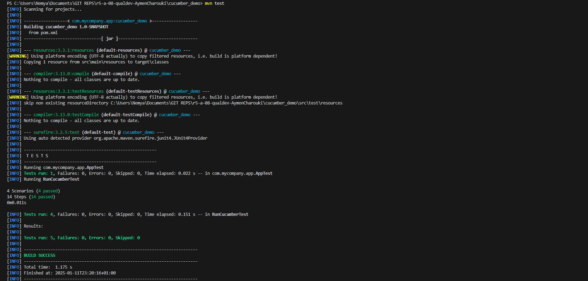
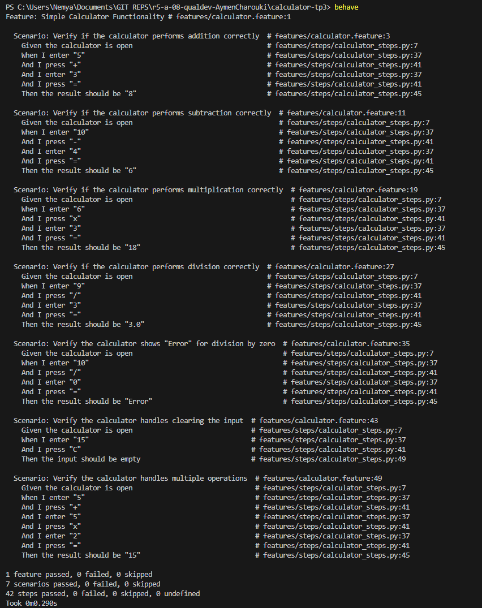

= R5.A.08 -- Dépôt pour les TPs - CHAROUKI AYMEN 2A
:icons: font
:toc: left
:toclevels: 2
:MoSCoW: https://fr.wikipedia.org/wiki/M%C3%A9thode_MoSCoW[MoSCoW]

Ce dépôt concerne les rendus de mailto:aymen.charouki@etu.univ-tlse2.fr[CHAROUKI AYMEN].

== Table des matières

toc::[]

== TP1

=== Contenu du fichier is_it_friday_yet.feature

[source,gherkin]
----
Feature: Est-ce déjà vendredi ?

  Scenario Outline: Vérifier si c'est vendredi
    Given aujourd'hui c'est "<day>"
    When je demande si c'est déjà vendredi
    Then on devrait me dire "<answer>"

  Examples:
    | day            | answer |
    | vendredi       | Oui    |
    | dimanche       | Non    |
    | lundi          | Non    |
    | anything else! | Non    |
----

=== Résultats des Tests : 

image::TP1-TestsExec.png[]

== TP2

=== Contenu du fichier Order.java

[source,java]
----
import java.util.ArrayList;
import java.util.List;

public class Order {
    private String owner;
    private String target;
    private String message;
    private List<String> cocktails;

    public Order() {
        this.owner = "";
        this.target = "";
        this.cocktails = new ArrayList<>();
    }

    public String getOwner() {
        return owner;
    }

    public String getTarget() {
        return target;
    }

    public void declareOwner(String owner) {
        this.owner = owner;
    }

    public void declareTarget(String target) {
        this.target = target;
    }

    public void addCocktail(String cocktail)   {
        this.cocktails.add(cocktail);
    }

    public List<String> getCocktails() {
        return cocktails;
    }

    public String getMessage() {
        return message;
    }
    
    public void setMessage(String message) {
        this.message = message;
    }
    @Override
    public String toString() {
        return "From " + owner + " to " + target + ": " + message;
    }

}

----

=== Résultats des Tests : 

== TP3

=== Résultats des Tests : 

