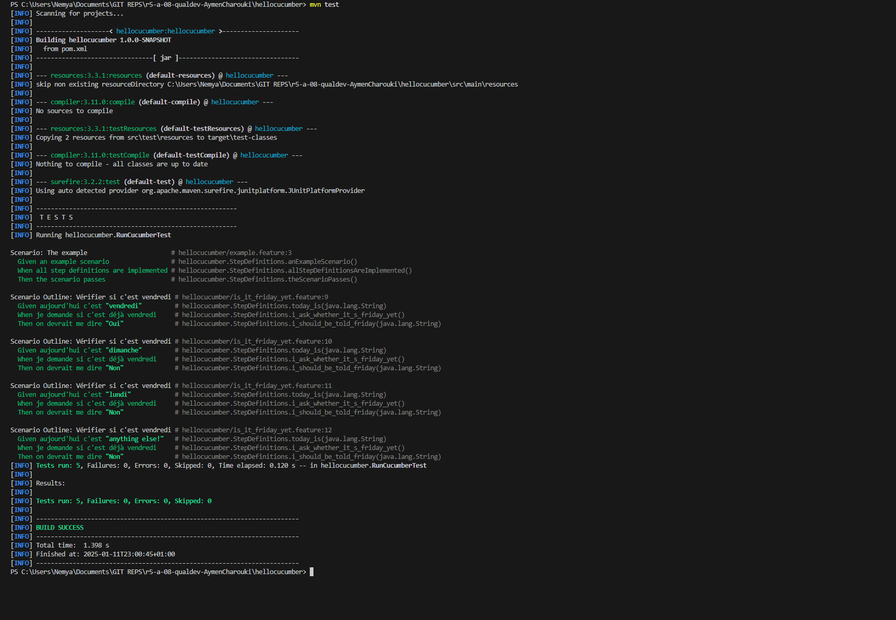

= R5.A.08 -- Dépôt pour les TPs - CHAROUKI AYMEN 2A
:icons: font
:MoSCoW: https://fr.wikipedia.org/wiki/M%C3%A9thode_MoSCoW[MoSCoW]

Ce dépôt concerne les rendus de mailto:aymen.charouki@etu.univ-tlse2.fr[CHAROUKI AYMEN].

== TP1

.Contenu du fichier is_it_friday_yet.feature
[source,java]
---
Feature: Est-ce déjà vendredi ?
    Scenario Outline: Vérifier si c'est vendredi
        Given aujourd'hui c'est "<day>"
        When je demande si c'est déjà vendredi
        Then on devrait me dire "<answer>"

    Examples:
        | day            | answer |
        | vendredi       | Oui    |
        | dimanche       | Non    |
        | lundi          | Non    |
        | anything else! | Non    |
---

== TP2...
