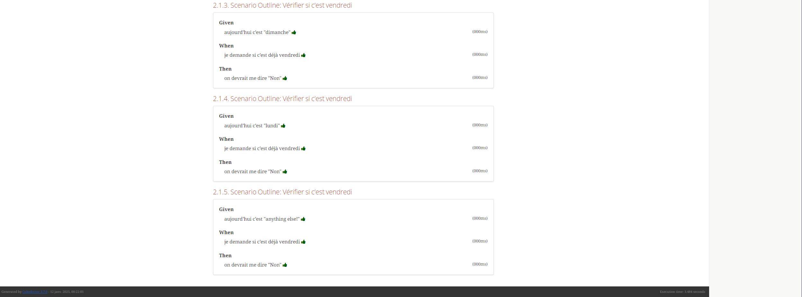

= R5.A.08 -- Dépôt pour les TPs - CHAROUKI AYMEN 2A
:icons: font
:toc: left
:toclevels: 2
:MoSCoW: https://fr.wikipedia.org/wiki/M%C3%A9thode_MoSCoW[MoSCoW]

Ce dépôt concerne les rendus de mailto:aymen.charouki@etu.univ-tlse2.fr[CHAROUKI AYMEN].

== Table des matières

toc::[]

== TP1

=== Contenu du fichier is_it_friday_yet.feature

[source,gherkin]
----
Feature: Est-ce déjà vendredi ?

  Scenario Outline: Vérifier si c'est vendredi
    Given aujourd'hui c'est "<day>"
    When je demande si c'est déjà vendredi
    Then on devrait me dire "<answer>"

  Examples:
    | day            | answer |
    | vendredi       | Oui    |
    | dimanche       | Non    |
    | lundi          | Non    |
    | anything else! | Non    |
----

=== Résultats des Tests : 

image::TP1-TestsExec.png[]

== TP2

=== Contenu du fichier Order.java

[source,java]
----
import java.util.ArrayList;
import java.util.List;

public class Order {
    private String owner;
    private String target;
    private String message;
    private List<String> cocktails;

    public Order() {
        this.owner = "";
        this.target = "";
        this.cocktails = new ArrayList<>();
    }

    public String getOwner() {
        return owner;
    }

    public String getTarget() {
        return target;
    }

    public void declareOwner(String owner) {
        this.owner = owner;
    }

    public void declareTarget(String target) {
        this.target = target;
    }

    public void addCocktail(String cocktail)   {
        this.cocktails.add(cocktail);
    }

    public List<String> getCocktails() {
        return cocktails;
    }

    public String getMessage() {
        return message;
    }
    
    public void setMessage(String message) {
        this.message = message;
    }
    @Override
    public String toString() {
        return "From " + owner + " to " + target + ": " + message;
    }

}

----

=== Résultats des Tests : 

== TP3

[source,gherkin]
----

Feature: Simple Calculator Functionality

  Scenario: Verify if the calculator performs addition correctly
    Given the calculator is open
    When I enter "5"
    And I press "+"
    And I enter "3"
    And I press "="
    Then the result should be "8"

  Scenario: Verify if the calculator performs subtraction correctly
    Given the calculator is open
    When I enter "10"
    And I press "-"
    And I enter "4"
    And I press "="
    Then the result should be "6"

  Scenario: Verify if the calculator performs multiplication correctly
    Given the calculator is open
    When I enter "6"
    And I press "x"
    And I enter "3"
    And I press "="
    Then the result should be "18"

  Scenario: Verify if the calculator performs division correctly
    Given the calculator is open
    When I enter "9"
    And I press "/"
    And I enter "3"
    And I press "="
    Then the result should be "3.0"

  Scenario: Verify the calculator shows "Error" for division by zero
    Given the calculator is open
    When I enter "10"
    And I press "/"
    And I enter "0"
    And I press "="
    Then the result should be "Error"

  Scenario: Verify the calculator handles clearing the input
    Given the calculator is open
    When I enter "15"
    And I press "C"
    Then the input should be empty

  Scenario: Verify the calculator handles multiple operations
    Given the calculator is open
    When I enter "5"
    And I press "+"
    And I enter "5"
    And I press "x"
    And I enter "2"
    And I press "="
    Then the result should be "15"

----

=== Implémentation: 

[source,python]
----

from behave import given, when, then
import tkinter as tk

context = {}

@given('the calculator is open')
def step_impl(context):
    context.root = tk.Tk()
    context.entry = tk.Entry(context.root)
    context.entry.pack()

    context.buttons = {
        '7': tk.Button(context.root, text="7", command=lambda: context.entry.insert(tk.END, '7')),
        '8': tk.Button(context.root, text="8", command=lambda: context.entry.insert(tk.END, '8')),
        '9': tk.Button(context.root, text="9", command=lambda: context.entry.insert(tk.END, '9')),
        '4': tk.Button(context.root, text="4", command=lambda: context.entry.insert(tk.END, '4')),
        '5': tk.Button(context.root, text="5", command=lambda: context.entry.insert(tk.END, '5')),
        '6': tk.Button(context.root, text="6", command=lambda: context.entry.insert(tk.END, '6')),
        '1': tk.Button(context.root, text="1", command=lambda: context.entry.insert(tk.END, '1')),
        '2': tk.Button(context.root, text="2", command=lambda: context.entry.insert(tk.END, '2')),
        '3': tk.Button(context.root, text="3", command=lambda: context.entry.insert(tk.END, '3')),
        '0': tk.Button(context.root, text="0", command=lambda: context.entry.insert(tk.END, '0')),
        '+': tk.Button(context.root, text="+", command=lambda: context.entry.insert(tk.END, '+')),
        '-': tk.Button(context.root, text="-", command=lambda: context.entry.insert(tk.END, '-')),
        'x': tk.Button(context.root, text="x", command=lambda: context.entry.insert(tk.END, '*')),  
        '/': tk.Button(context.root, text="/", command=lambda: context.entry.insert(tk.END, '/')),
        '=': tk.Button(context.root, text="=", command=lambda: evaluate(context)),
        'C': tk.Button(context.root, text="C", command=lambda: context.entry.delete(0, tk.END)),
    }

    for button in context.buttons.values():
        button.pack()

    context.root.update_idletasks()

@when('I enter "{value}"')
def step_impl(context, value):
    context.entry.insert(tk.END, value)

@when('I press "{button}"')
def step_impl(context, button):
    context.buttons[button].invoke() 

@then('the result should be "{result}"')
def step_impl(context, result):
    assert context.entry.get() == result

@then('the input should be empty')
def step_impl(context):
    assert context.entry.get() == "", f"Expected input to be empty, but got: {context.entry.get()}"

def evaluate(context):
    try:
        expression = context.entry.get()
        result = str(eval(expression))  
        context.entry.delete(0, tk.END)
        context.entry.insert(tk.END, result) 
    except Exception as e:
        context.entry.delete(0, tk.END)
        context.entry.insert(tk.END, "Error")

----

=== Explication de l'objectif 

La calculatrice a été créée il y a quelque temps en utilisant Python et Tkinter pour permettre des calculs de base. Cependant, les tests automatisés avec Behave ont été ajoutés dnas ce TP afin d'améliorer la qualité et la fiabilité de l'application. Ces tests ont permis de valider et d'améliorer certaines fonctionnalités, comme la gestion des erreurs (par exemple, la division par zéro) et l'exécution d'opérations multiples. Grâce à cette phase de tests, j'ai pu identifier des points d'amélioration et renforcer la stabilité du programme, ce qui a permis de le rendre plus robuste et plus fiable dans un cadre de développement professionnel.

=== Résultats des Tests : 

image::TP3-TestsExec.png[]

== TP4

=== mvn test | Select-Object -Last 16 | Out-File report.txt (windows)

[source,shell]
----
include::report.txt
----

=== mvn cukedoctor:execute

=== SERENITY

Je n'ai pas réussi à faire générer le site sur mon projet.